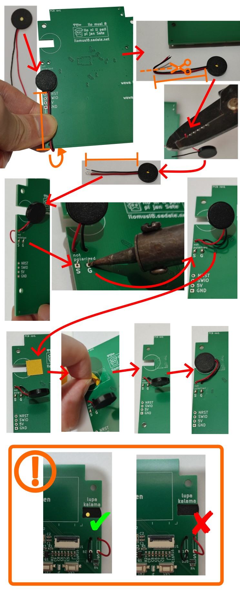
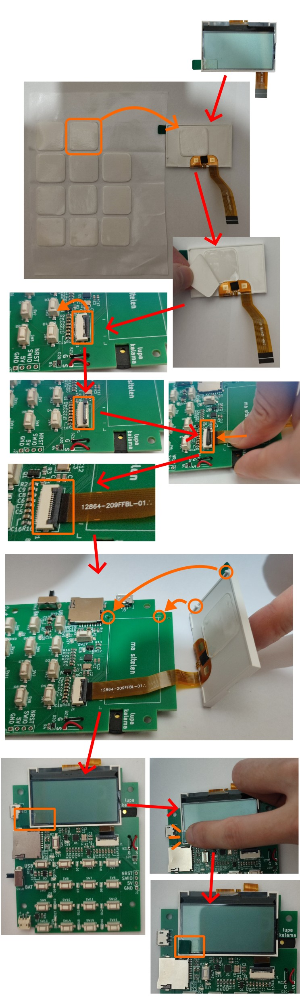
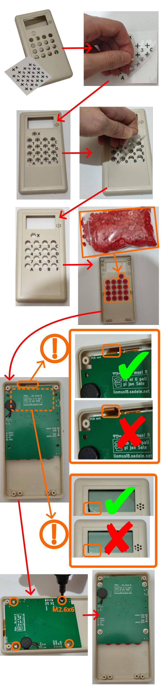
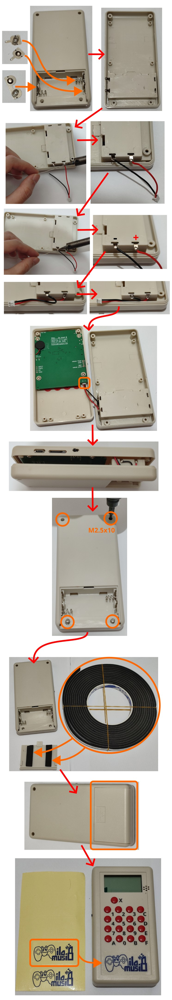
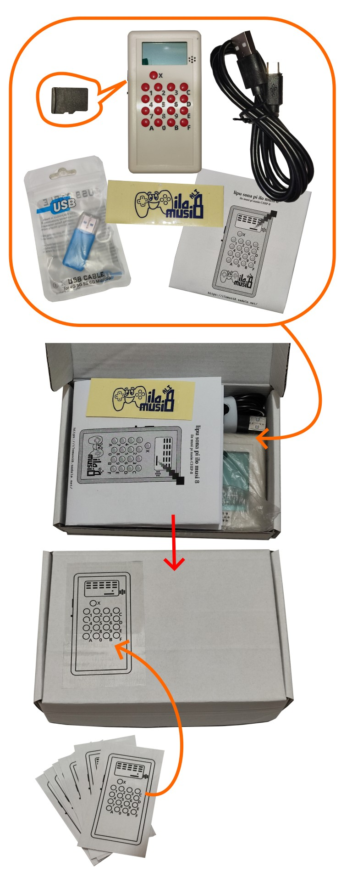

**(English: Scroll down for English | toki ike Inli li lon anpa pi toki pona)**

# o pali e ilo musi 8!

sina wile pali e ilo musi 8 la o kepeken nasin ni:

# o esun e ali!

o lukin e lipu [`full_bom.csv`](./full_bom.csv) li esun e ali pi ilo musi 8.

# lipu kiwen sona

## lipu kiwen sona: o pana e ilo kalama!



## lipu kiwen sona: o pana e ilo sitelen!



## lipu kiwen sona: o pana e sona!


* o kepeken ilo "WCH-LinkE" sama sitelen sewi ni. ni la o pana e nimi ni tawa ilo sona sina:

```
export CH32FUN_PATH=/path/to/ch32fun  # https://github.com/cnlohr/ch32fun
cd /path/to/ilo-musi-8/bootloader/
make
make optionbytes
cd /path/to/ilo-musi-8/firmware/
make
```

# selo

## selo: o pana e sitelen nena e nena e lipu kiwen sona!



## selo: o pali e ijo pi poki wawa! o wan e poki!



# o lukin e pakala!

1. o pana e poki wawa "AAx2" tawa ilo musi 8. taso o pana ala e wawa e lipu sona "TF Card" tawa ona
2. o pilin awen e nena "D" e nena "E". ni la o pana e wawa
3. o pilin e nena "A". kalama musi li lon
4. o pilin e nena "B". suno pi ilo sitelen li weka. o pilin sin e nena "B". suno li kama sin
5. o pilin e nena "C". ilo sitelen li kama pimeja ala. o pilin sin e nena "C". ilo sitelen li kama pimeja ali
6. o pilin e nena "X"
7. o lukin e nanpa suli. nanpa ni li wawa "mV" pi ilo sona. nanpa "3250~3350" li pona
8. nena ali li jo e nanpa. sina pilin e nena lon tenpo wan la nanpa li kama wan. lon tenpo tu la nanpa li kama tu. nena ali la o pilin lon tenpo luka tu tu (9). nanpa ali li kama luka tu tu (9).
9. o weka e wawa. o pana e lipu sona "TF Card". musi o insa lipu sona ni.
10. o pana e wawa kepeken linja wawa "USB"
11. o lukin e ni: musi pi lipu sona li lon
12. o anu e ijo musi. sina pana e ijo sin tawa musi ni la pakala o lon ala!

# o poki e ali!



# pini!

ni li pini. tenpo ni la sina jo e ilo musi 8 wan! :D

kepeken nasin ni la sina ken pali e ilo musi 8 pi mute "10~50".

sina wile pali e ilo musi 8 pi mute mute "100~200" la o ante e ona. ni la sina ken pali e ona kepeken mani lili.

# Building ilo musi 8 Unit(s)

This is the step-by-step instruction of assembling your own ilo musi 8 unit(s):

# Purchase Material

Please purchase all of the material in this BOM file: [`full_bom.csv`](./full_bom.csv)

# PCBA

The PCBA received from the factory isn't completed. Here's the post-processing steps required:

## PCBA: Putting on Buzzer


## PCBA: Installing LCD


## PCBA: Programming


* Please connect "WCH-LinkE" as shown above and run the following commands on your computer:

```
export CH32FUN_PATH=/path/to/ch32fun  # https://github.com/cnlohr/ch32fun
cd /path/to/ilo-musi-8/bootloader/
make
make optionbytes
cd /path/to/ilo-musi-8/firmware/
make
```

# Enclosure

## Enclosure: Front Part


## Enclosure: Back Part


# Quality Control

1. Insert "AAx2" into the ilo musi 8 unit without powering it on for now. Do not insert TF card either.
2. Hold "D" and "E" and power it on to enter hardware test mode
3. Press "A". Make sure that there's audio clip being played
4. Press "B". Make sure that LCD backlight would turn off. Press "B" again. Make sure that it'd turn on again
5. Press "C". Make sure that the LCD display would be all pixel off. Press "C" again. Make sure that LCD display would be all pixel on. Pay attention to possible dead pixels
6. Press "X" to enter another page
7. Pay attention to the number shown on the top-right corner. That's the voltage of ilo musi 8 in unit of mV. Make sure that the displayed value is between "3250~3350"
8. The display shows the button press count of each button. Press each of the buttons 9 times and make sure that 9 would be displayed for each button. (To retest, after reaching 9, the counter would wrap to 0. If the counter of button X wraps, all numbers would be reset to 0)
9. Power off. Insert TF Card that's loaded with a game
10. Power it on with USB cable
11. Make sure that the game selection menu's shown
12. Select a game and modify game config and save it. Make sure that no error would be shown

# Pack Everything


# Done!

That's it! You've successfully built a unit of ilo musi 8. Build more if required! :D

This product is optimized for manufacturing with batch size of 10~50 and can be built at home.

For quantity above 100~200, I'd recommend modifying the design for further cost optimization (e.g. build PCBA test jig, order a custom mold for the enclosure, etc.)
