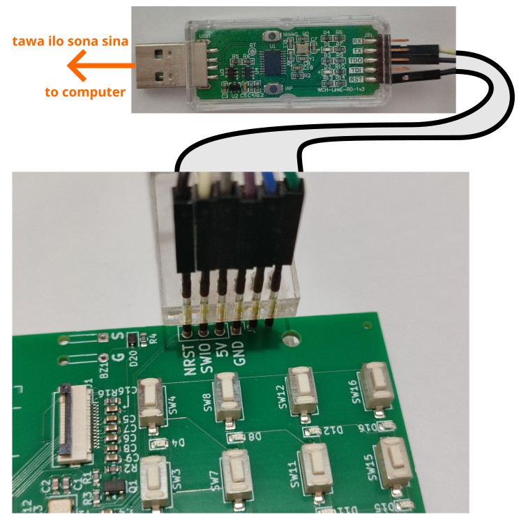
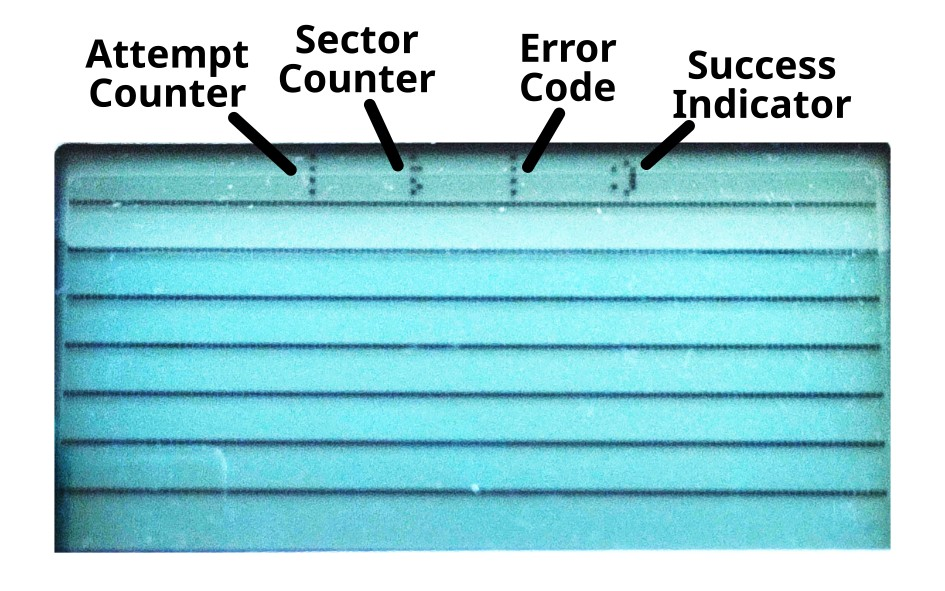
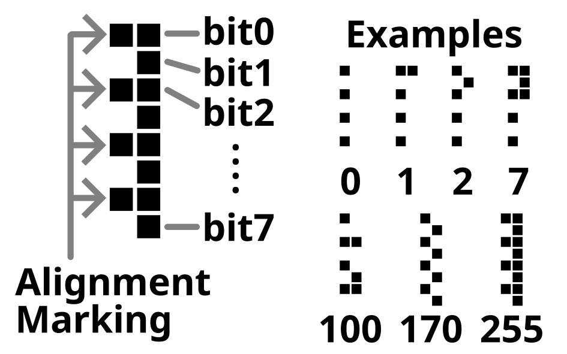

**(English: Scroll down for English | toki ike Inli li lon anpa pi toki pona)**

# ilo "Bootloader" li seme?

* kepeken ilo ni la jan li ken pana e sona sin tawa ilo musi 8 kepeken lipu sona "TF Card"
* lipu sona li jo e lipu `ILOMUSI8.BIN` la ilo ni li wile pana e sona tawa ilo musi 8 kepeken ijo insa `ILOMUSI8.BIN`
* sina ken pana e ilo ni tawa ilo musi 8 kepeken ilo "WCH-LinkE". o kepeken nimi ni: `CH32FUN_PATH=/path/to/ch32fun make`
* kin la sina o kepeken nimi ni: `CH32FUN_PATH=/path/to/ch32fun make optionbytes`. sina kepeken ala nimi ni la ilo "Bootloader" li pali ala a!
* sina wile ala kepeken ilo `make` la sina kin li ken kepeken ilo `minichlink` kepeken `bootloader.bin`

## sitelen pi ilo "Bootloader" li seme?

nimi `:)` li lon la ali li pona. nimi `:(` li lon la ijo li pakala.

sitelen namako li ike suli. o lukin e toki Inli lon anpa!

# Bootloader of ilo musi 8

* Provides mechanism of flashing firmware via TF Card
* Upon detecting `ILOMUSI8.BIN`, the bootloader would flash the file to Code FLASH
* To flash, WCH-LinkE is required. Run the following command after connecting ilo musi 8 with WCH-LinkE: `CH32FUN_PATH=/path/to/ch32fun make`
* You also need to enable the bootloader with the following command: `CH32FUN_PATH=/path/to/ch32fun make optionbytes`
* Instead of using make, you can flash the bootloader by using the pre-built binary `bootloader.bin` with `minichlink`

## Mechanism of Avoiding Re-entrance of Bootloader

The bootloader does not delete nor rename `ILOMUSI8.BIN`. It's the job of the main app to do that, which renames `ILOMUSI8.BIN` to `ILOMUSI8.BI_` upon success.

## Firmware Update Algorithm

Upon `ILOMUSI8.BIN` is detected, the bootloader performs the following:

For each sector (1024 bytes) of the Code FLASH:

1. Compare the difference between the `ILOMUSI8.BIN` and the Code FLASH
2. Flash the sector if there's any difference
3. After comparing all sectors, if any flashing had occurred, redo the entire procedure. The retry limit is 5 times.

## Meaning of the Bootloader Screen

Here's the meaning of the content shown on the screen:

* Attempt Counter: 0 means no flashing performed because the Code FLASH's unchanged. 1 means flashing performed once. 2 means flashing performed twice and so on.
* Sector Counter: The sector number of the current iteration attempt. Each sector is 1024 bytes.
* Error Code: The FatFs return code. 0 means OK. See https://elm-chan.org/fsw/ff/doc/rc.html for the full list
* Success Indicator: Shows `:)` upon success. `:(` upon failure, and `:` while update is in progress

Here's how to read the numbers above:

