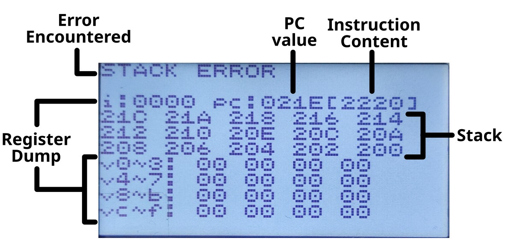

**(English: Scroll down for English | toki ike Inli li lon anpa pi toki pona)**

# sona pi ilo musi 8

kepeken sona ni la ilo musi 8 li ken pali. sina ken pana e sona ni tawa ilo musi 8 kepeken nasin tu:

* nasin nanpa wan: o kepeken ilo `CH32FUN_PATH=/path/to/ch32fun make`. kin la sina ken kepeken ilo `minichlink` kepeken lipu `ilomusi8.bin`
* nasin nanpa tu: o pana e `ilomusi8.bin` tawa lipu sona "TF Card". o pana e lipu sona ni tawa ilo musi 8 sina. sina pana e wawa la sona pi ilo musi 8 li kama sona `ilomusi8.bin`

# Firmware of ilo musi 8

This is the firmware of ilo musi 8. You can flash it with the following means:

* Method 1: Run `CH32FUN_PATH=/path/to/ch32fun make`. Alternatively you can use `minichlink` to load the prebuilt binary `ilomusi8.bin` to your ilo musi 8 unit
* Method 2: Put the `ilomusi8.bin` to a TF card and insert it into your ilo musi 8 unit. Power it on and the bootloader would flash it

# Technical Documentation

(ni li ike suli. mi o kepeken ala toki pona!)

## To Build

Download [ch32fun](https://github.com/cnlohr/ch32fun/tree/master) separately.
Run `CH32FUN_PATH=/path/to/ch32fun make` to build.
It'd also perform flashing if you attached your ilo nena 8 via WCH-LinkE.

## Code FLASH Memory Layout

The 62kB Code FLASH area of the CH32V006 is partitioned into the following layout:

* 0x8000000 ~ 0x800DFFF (56kB): App
* 0x800E000 ~ 0x800E7FF (2kB): Global Config (e.g. buzzer volume, backlight, etc.)
* 0x800E800 ~ 0x800F7FF (4kB): BOOTROM, including its config

Since I'm using the linker script from the ch32fun upstream, I'm not overriding it.
Instead, the layout is implicitly enforced by ensuring that the app's flash size is below 56kB in the Makefile.

## Bulkmem Memory Sharing Mechanism

Since I'm running low on RAM and I'd like to ensure that `chip8.c` and `chip8.h` can be self-contained,
I'm doing something clever (and not-so-obvious) to use the CHIP-8 emulator's main memory area for something else while the emulator isn't running.
Please refer to `bulkmem.h` on how it works.

## DMA Allocation

The following DMA channels are used:

* Very high priority: SPI RX, DMA channel 2. Used by the TF Card operation `rcvr_mmc_with_crc()`.
* High Priority: Buzzer Timer (TIM3), DMA channel 4. Triggering rate depends on the pitch.
* Medium Priority: Button ADC, DMA channel 1. Triggered for each row scan.
* Low Priority: SPI TX, DMA channel 3. Used by the lcd operation `lcd_transfer_next_row()`, and the TF Card operations `xmit_mmc_with_crc()` and `rcvr_mmc_with_crc()`.

## ISR Allocation

The follow ISR handlers has been configured:

* Highest priority (0x00): Button ADC (DMA1_Channel1_IRQHandler). Triggered upon completion of row scanning
* Second highest priority (0x80): SPI TX for LCD (DMA1_Channel3_IRQHandler). Triggered upon completion of transfer of an LCD data row

The MCU supports two levels of preemption and the ADC interrupt handler is configured to be able to preempt the LCD interrupt handler.

## SPI Sharing

The SPI peripheral is shared between TF card and the LCD as follows:

* SPI_SCK - shared
* SPI_MOSI - shared
* SPI_MISO - for TF card only
* CARD_CS - for TF card only
* LCD_CS - for LCD only

Upon insertion of the TF card, it uses an incompatible proprietary protocol with CARD_CS ignored. It must be switched to SPI mode as soon as possible to avoid LCD commands messing with the card.

This mechanism is handled in `file_loop()`, which gets called once in the main loop of `main()`.

## PWM Configuration

TIM1 is used for PWM with frequency of 400khz. The valid PWM value is 0~15 (0 is full off, 15 is full on, 1~14 is anything in between).

It's used for LCD backlight adjustment and the buzzer volume adjustment.

* Initialization function: See `tim1_pwm_init()`
* LCD backlight adjustment: See `lcd_set_brightness()`
* Buzzer volume adjustment: See `buzzer_reload_dma_buffer()`. The volume (0-15) gets loaded to the DMA buffer, which's played by DMA1_Channel4.
	* For example, if the waveform is `[0,1,0,0,1,0,...]` and the volume is 15, the DMA buffer would be `[0,15,0,0,15,0,...]`
	* For the same waveform, if the volume is 8, the DMA buffer would become `[0,8,0,0,8,0,...]`

## CHIP-8 Emulator

The `chip8.c` and `chip8.h` are an implementation of CHIP-8 emulator. These two files are intentionally self-contained and does not make reference to any other files in this repo.

This way one could easily reuse the emulator in any other C codebases.

This is also the reason why the draw function `DXYN` does not share the draw functions in `draw.c`

## Crash Screen Documentation

In case the game's crashed, a crash screen would be shown. Here's the meaning of the crash screen:



## Game Config INI Format Specification

Each game can have an INI file for specifying its configuration. The following fields can be specified:

| Field | Alias (in Toki Pona) | Datatype | Range | Description | Default Value |
| --- | --- | --- | --- |  --- | --- |
| quirks | nasin | HEXNUM | HEX x8 | For compatibility of ROM written for different CHIP-8 implementations. See `CHIP8_QUIRK_*` in chip8.h | 00000888 |
| speed | tenpo | DECNUM | 0~99 | Game speed. 0 is unlimited, 1~99 to set the speed limit (instruction/frame). Each frame is 60Hz. | 00 |
| audio | kalama | HEXBUF | HEX x32 | The audio buffer upon game launch. 1-bit. Sampling rate depends on the pitch. | F0F0F0F0F0F0F0F0F0F0F0F0F0F0F0F0 |
| pitch | wawa-kalama | DEC | 0~256 | The audio sampling rate upon game launch. Value is `4000*2^((X-64)/48)` Hz. | 64 |
| font | sitelen | HEXBUF | HEX x160 | The 4x5 font used in the game. | F0909090F02060202070F010F080F0F010F010F09090F01010F080F010F0F080F090F0F010204040F090F090F0F090F010F0F090F09090E090E090E0F0808080F0E0909090E0F080F080F0F080F08080 |
| font-large | sitelen-suli | HEXBUF | HEX x320 | The 8x10 font used in the game. | FFFFC3C3C3C3C3C3FFFF1878781818181818FFFFFFFF0303FFFFC0C0FFFFFFFF0303FFFF0303FFFFC3C3C3C3FFFF03030303FFFFC0C0FFFF0303FFFFFFFFC0C0FFFFC3C3FFFFFFFF0303060C18181818FFFFC3C3FFFFC3C3FFFFFFFFC3C3FFFF0303FFFF7EFFC3C3C3FFFFC3C3C3FCFCC3C3FCFCC3C3FCFC3CFFC3C0C0C0C0C3FF3CFCFEC3C3C3C3C3C3FEFCFFFFC0C0FFFFC0C0FFFFFFFFC0C0FFFFC0C0C0C0 |
| layout | ma-nena | DECNUM | 0~2 | Keypad layout. Shown before the game's launched. See `enum chip8_input_layout` in chip8.h | 0 |
| navigation | nena-tawa | HEXFLAG | HEX x(0~16) | The in-game buttons used for navigation. Shown before the game's launched. | (empty) |
| action | nena-pali | HEXFLAG | HEX x(0~16) | The in-game buttons used for action. Shown before the game's launched. | (empty) |
| replay | nena-sin | HEXFLAG | HEX x(0~16) | The in-game buttons used for replay or for starting the game. Shown before the game's launched. | (empty) |

Only the quirks and speed can be modified via the game config screen in the console. All other values must be modified by direct modification of the INI file.

Full Example:

```
quirks = 00002413
speed = 30
audio = FFFFFF00FFFFFF00FFFFFF00FFFFFF00
pitch = 16
font = 60A0A0A0C040C04040E0C0204080E0C0204020C020A0E02020E080C020C04080C0A040E02060404040A040A04040A060204040A0E0A0A0C0A0C0A0C06080808060C0A0A0A0C0E080C080E0E080C08080
font-large = 7CC6CEDED6F6E6C67C001030F03030303030FC0078CCCC0C183060CCFC0078CC0C0C380C0CCC78000C1C3C6CCCFE0C0C1E00FCC0C0C0F80C0CCC78003860C0C0F8CCCCCC7800FEC6C6060C183030300078CCCCEC78DCCCCC78007CC6C6C67C18183070003078CCCCCCFCCCCCCC00FC6666667C666666FC003C66C6C0C0C0C6663C00F86C66666666666CF800FE6260647C646062FE00FE6662647C646060F000
layout = 1
navigation = 5789
action = 6
replay = F
```
