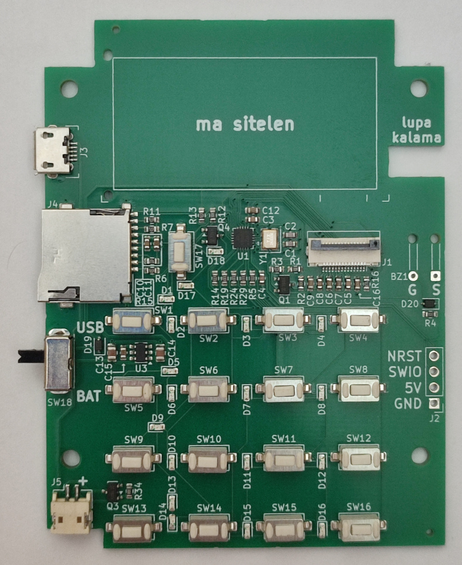

**(English: Scroll down for English | toki ike Inli li lon anpa pi toki pona)**

# lipu kiwen sona

ma ni li jo e sona pi lipu kiwen. mi pali e ona kepeken ilo "KiCad" en ilo lili "[Fabrication-Toolkit](https://github.com/bennymeg/Fabrication-Toolkit)".

sina ken esun e lipu kiwen sona kepeken nasin ni:

1. o open e lipu `ilomusiali-production.zip`
2. insa lipu `ilomusiali-production.zip` la o pana e ni tawa tomo pali: lipu `ilomusiali.zip` li lipu "gerber". lipu `bom.csv` en lipu `positions.csv` li lipu "SMT". mi kepeken tomo pali "JLCPCB".
3. o pana e mani tawa tomo pali. ni la sina o awen. lipu kiwen sona li jo e ijo mute. taso ilo sitelen en ilo kalama li lon ala.
4. o sona e ni: ilo kalama en ilo sitelen li lon ala. o pana e ona kepeken nasin insa [ma ni](../assembly/).

# PCBA Source and Production Files

This folder contains the source and production files for the PCBA. It uses KiCad with production files generated with the plugin "[Fabrication-Toolkit](https://github.com/bennymeg/Fabrication-Toolkit)".

To order PCBA on your own:

1. Extract `ilomusiali-production.zip`
2. Inside the extracted files, send `ilomusiali.zip` as gerber. `bom.csv` and `positions.csv` as SMT files. I used JLCPCB for the PCBA.
3. Pay up and wait for delivery. The PCBA has all electronic parts except for the screen and the buzzer, which you need to put that on your own.
4. Please notice that the buzzer and LCD aren't included. You need to put it on on your own as shown in the [assembly instruction here](../assembly/)
